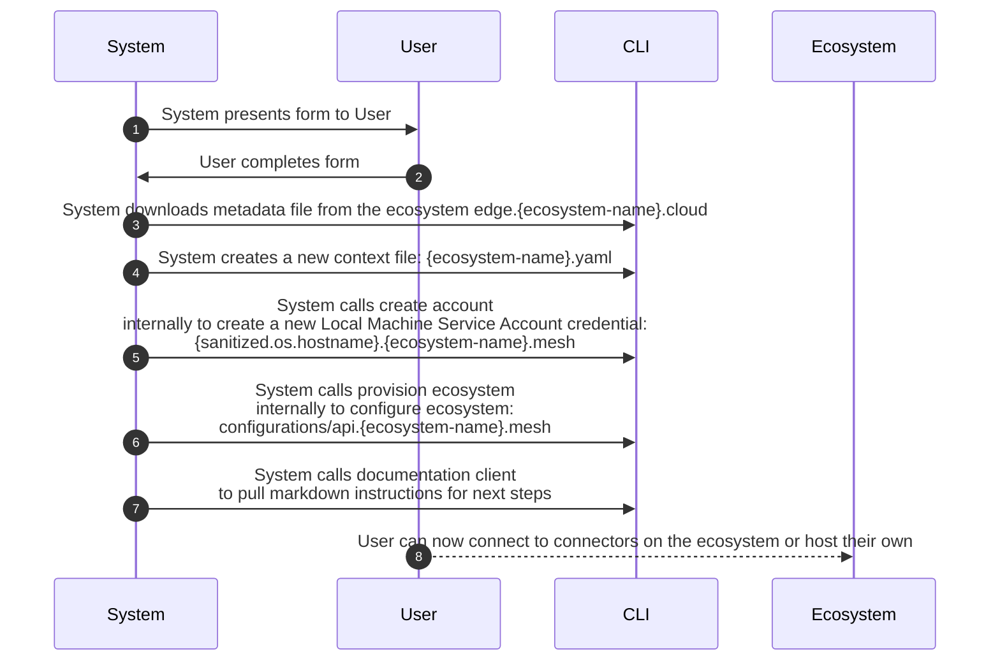

## oeco ecosystem join

Join an existing ecosystem

```bash
oeco ecosystem join
```

## Ecosystem Join

### Pre-conditions

-   You must have the oeco cli installed
-   An ecosystem must already exists

### Pre-condition wire validations

### Pre-condition logic validations

### Post-conditions

### Form

-   Pick an ecosystem domain name. This will be your main domain {domain-name}.mesh
    -   (go get -u github.com/segmentio/go-slugify)
-   Type
-   Cidr

### Business Logic


