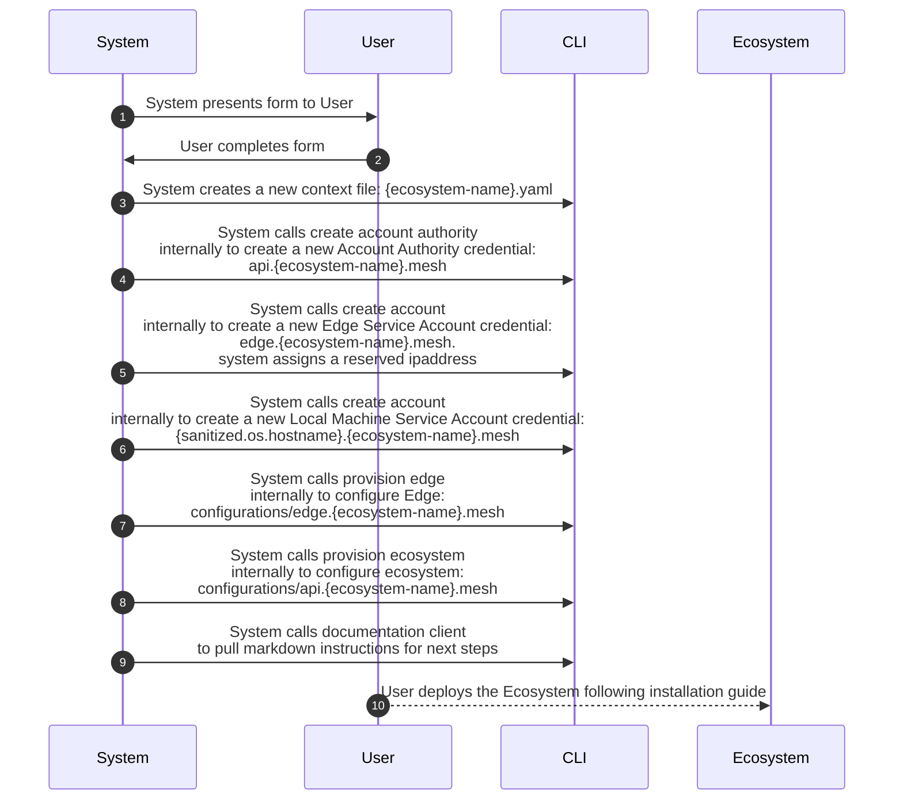

## oeco ecosystem
Dynamically see economic system members and their capabilities

```bash
oeco ecosystem create
```

## Ecosystem Create
### Pre-conditions
- You must have the oeco cli installed

### Pre-condition wire validations
- Domain Name: ecosystem name must adhere to the following rules
  - [RFC-1035 Domain Names](https://www.rfc-editor.org/rfc/rfc1035)
    - Alphanumeric characters (A-Z, a-z, 0-9)
    - Dashes (-) (but not at the start or end)
    - Case insensitive (DNS is not case-sensitive, but lowercase is recommended)
    - Underscores (_) → RFC 1035 does not allow _, but some systems (like SRV records) permit it. 
    - Spaces → Not allowed in any part of a domain name. 
    - Special characters (! @ # $ % ^ & * ( ) + = etc.) → Not allowed.
    - Each subdomain (label): 1 to 63 characters 
    - Full domain name (including all levels and dots): Up to 253 characters
  - [RFC-2181 Name Syntax](https://www.rfc-editor.org/rfc/rfc2181#section-11)

### Pre-condition logic validations

### Post-conditions
- When running the ecosystem, start a pushpin client to listen for discovery changes
- Tabs
    - Active Connectors
        - When it starts, pull the latest available connectors in the network (fetch all keys from the connector bucket),
        - then start pushpin for differentials
- Upon creating an ecosystem, create the following accounts:
    - api.{ecosystem-name}.mesh
    - edge.{ecosystem-name}.mesh
- To create more accounts, use oeco account create

### Form
- Pick an ecosystem domain name. This will be your main domain {domain-name}.mesh
  - (go get -u github.com/segmentio/go-slugify)
- Type
- Cidr


### Business Logic




