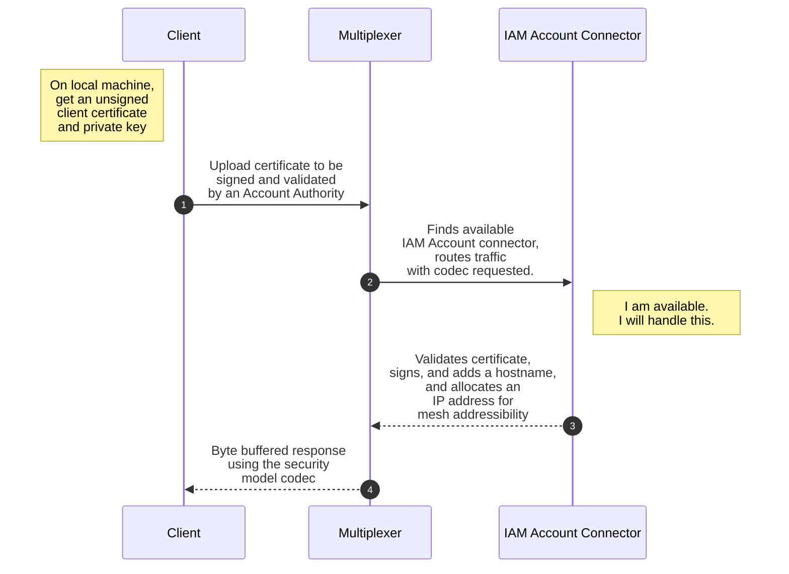
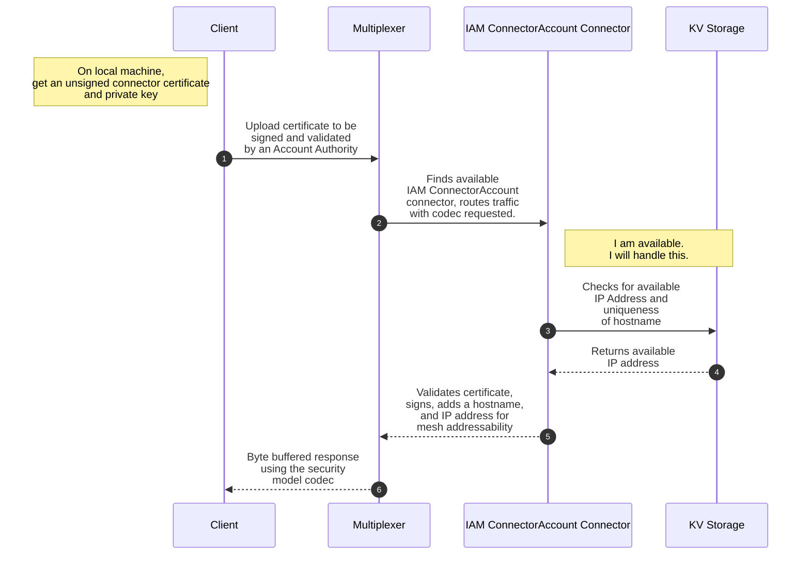
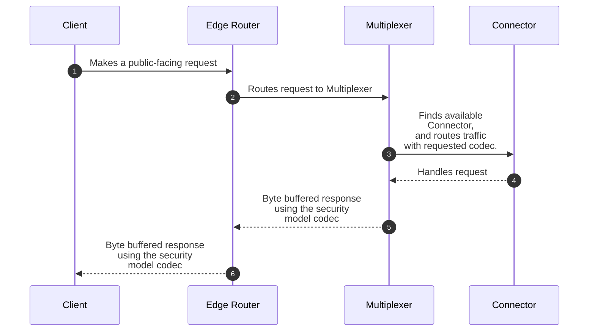

## Account Signature, Validation, and Association
create an iam user service. when you create an account you get a cert and key. upload crt to be signed by ca and get a unique hostname and ip address. user.oeco.mesh

## Connector Signature, Validation, and Association
create a connector account. upload crt to be signed by central ca server. ca server provisions an IP address on the network. and a unique hostname and ip. api.ecosystem.mesh/v2alpha/connector. this gets converted to the nats channel: api.ecosystem.b2alpha.connector or mesh.ecosystem.api.v2alha.connector
store this hostname in KV. store ip address in KV. ip is key, value is host. host is key, value is ip
we need a single key to find the next available IP address. ideally not sequentially.
this will auto register with dns.

## Traffic Flow Across Ports
For the Edge Router, there is a single port:
- 443/tcp
  - All internet facing traffic goes through this choke point

For the Event Multiplexer, there are three ports:
- 4222/tcp (Nats over mesh socket)
    - Nats is accessible over the mesh overlay network
- 4242/udp (Nebula)
- 6477/tcp (gRPC/REST/Connect)
    - Serves as API gateway for both internet and mesh traffic
    - Available over the public internet only through the event-router
    - Secured by mTLS

## Traffic Flow Across Meshes
Once client connection to mesh is established, all traffic no longer goes through edge-router (Ideally it does, revisit this)

Now, .mesh urls are now available. For example: api.ecosystem.mesh/v2alpha/connector

There are patient, private, and public ecosystems.
An organization can create either a private or public ecosystem.
By default, Open Economic Systems creates a public ecosystem.
- api.oeco.mesh/v2alpha/connector

