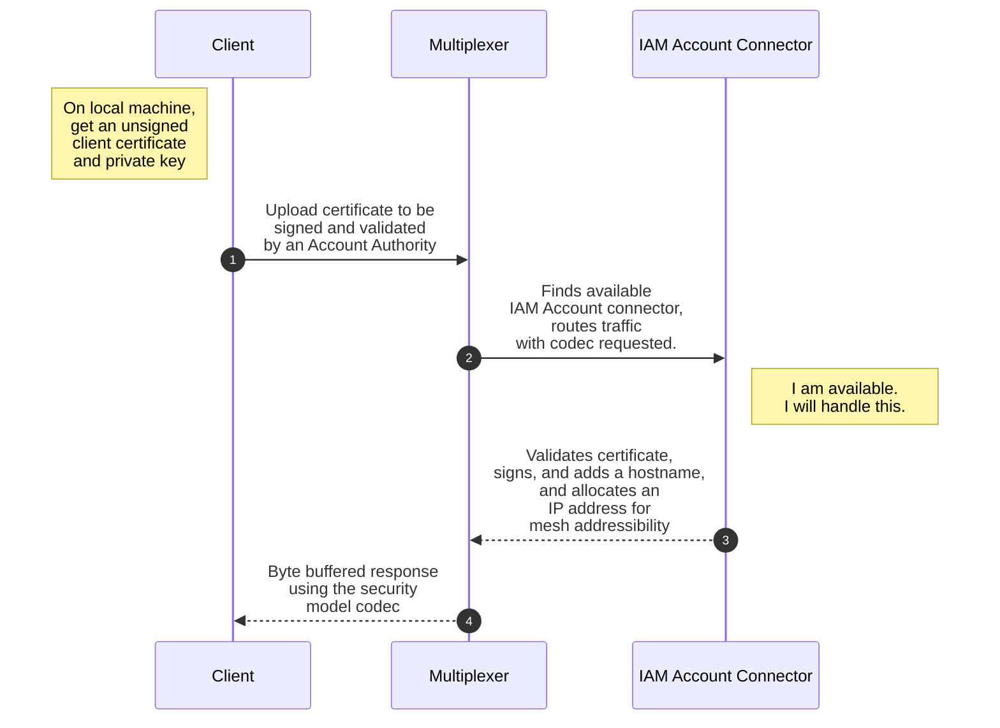

Join Existing

## Account Signature, Validation, and Association
Use the oeco CLI to create a new unsigned certificate and private key. 
Upload the public key to the Ecosystem Account Authority to be verified and signed at https://api.oeco.cloud

Once signed, the Account Authority will also append a unique hostname and ip address to your certificate.
Once your public key is signed by an Ecosystem Account Authority, you can now connect to the mesh network.

when you create an account you get a cert and key. upload crt to be signed by ca and get a unique hostname and ip address. user.oeco.mesh

